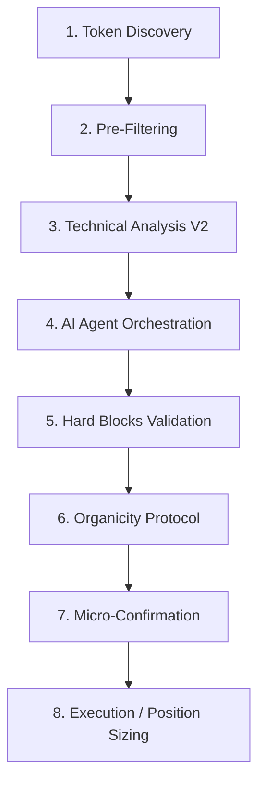
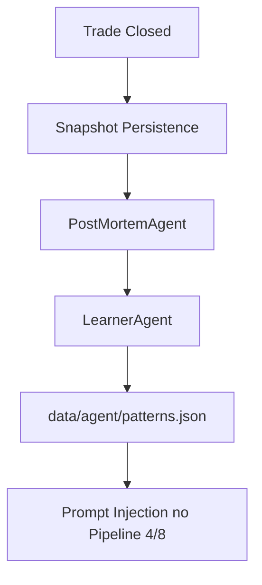

# 🤖 Arquitetura de Agentes de IA

Este documento descreve o ecossistema de agentes inteligentes que compõem o motor de decisão do bot. O sistema utiliza uma abordagem de **Pipeline de 8 Etapas**, refletida diretamente nos logs do terminal (ex: `[Pipeline 4/8]`).

Além do pipeline online, o bot agora possui um **ciclo offline de feedback** para trades perdedores. Esse fluxo roda fora do caminho crítico, reconstrói o contexto do trade e alimenta o aprendizado contínuo sem impactar a latência operacional.

## 🔄 Fluxo de Execução (Pipeline 8/8)

Para cada token detectado via gRPC, o bot percorre as seguintes fases:

---

## 🧩 Detalhamento das Etapas

### 1. Token Discovery
*   **Log**: `🔍 [Discovery]`
*   **Função**: Captura de novos mints via gRPC Subscription na Solana Mainnet.

### 2. Pre-Filtering (Nivel 0)
*   **Log**: `⚡ [PreFilter]`
*   **Função**: Rejeição instantânea (<1ms) de tokens com liquidez < 1 SOL, honeypots óbvios ou criadores em cooldown.

### 3. Technical Analysis V2 (Pipeline 3/8)
*   **Log**: `📊 [Pipeline 3/8 - Technical Analysis]`
*   **Função**: Coleta de indicadores avançados (RSI, MACD, EMA) para enriquecer o contexto da IA.
*   **Veredito**: APROVADO (Score > 55) ou ANALISADO (Informação Pura).

### 4. AI Agent Orchestration (Pipeline 4/8)
*   **Log**: `🧠 [Pipeline 4/8 - AI Agent]`
*   **Função**: O "Cérebro" do sistema. Orquestra sub-agentes (Risk, Scalper, Sentiment, Whale) para gerar uma decisão LLM.
*   **Veredito**: `BUY`, `SKIP` ou `WAIT_FOR_DIP`.

### 5. Hard Blocks Validation (Pipeline 5/8)
*   **Log**: `🛡️ [Pipeline 5/8 - Hard Blocks]`
*   **Função**: Re-validação imediata pós-LLM. Como a IA demora ~2-4s, este estágio garante que o token não se tornou um "scam" ou atingiu limites de segurança nesse intervalo.

### 6. Organicity Protocol (Pipeline 6/8)
*   **Log**: `🧬 [Pipeline 6/8 - Organicity]`
*   **Função**: Detecta manipulação de volume (staircase bots) e crescimento artificial. Bloqueia tokens que não possuem fluxo orgânico de holders reais.

### 7. Micro-Confirmation (Pipeline 7/8)
*   **Log**: `⏱️ [Pipeline 7/8 - Micro-Confirm]`
*   **Função**: Uma janela de observação final (3-8s) observando a saúde do token. Essencial para evitar "Dev Dumps" de lançamento.

### 8. Execution & Sizing (Pipeline 8/8)
*   **Log**: `🚀 [Pipeline 8/8 - Execution]`
*   **Função**: Cálculo dinâmico do lote com base na confiança da IA e envio da transação (Live ou Simulation).

---

## Offline Feedback Loop

Após o fechamento de um trade, o sistema executa uma esteira assíncrona de aprendizado:

### PostMortemAgent
*   **Log**: `🧠 [PostMortemAgent]`
*   **Função**: Analisa trades perdedores com contexto rico de entrada, saída, candles de 1s, TA, organicidade e trilha de monitoramento.
*   **Saída**: causa raiz provável, melhor janela de entrada, evidências, recomendações e regras candidatas.

### LearnerAgent
*   **Log**: `🧠 [LearnerAgent]`
*   **Função**: Consome os post-mortems gerados, sintetiza aprendizados recorrentes e injeta regras no prompt do agente principal.
*   **Observação**: O `PostMortemAgent` roda primeiro; o `LearnerAgent` usa essa análise enriquecida para produzir regras melhores.

---

## 🔗 Veja Também
- [Configuração de Estratégia](SCALPER_STRATEGY_OPTIMIZATION.md)
- [Proteção contra Manipulação](ORGANICITY_PROTECTION.md)
- [Documentação Técnica do AI Agent](AI_AGENT.md)
- [Implementação do Loss Post-Mortem Agent](LOSS_POSTMORTEM_AGENT.md)
