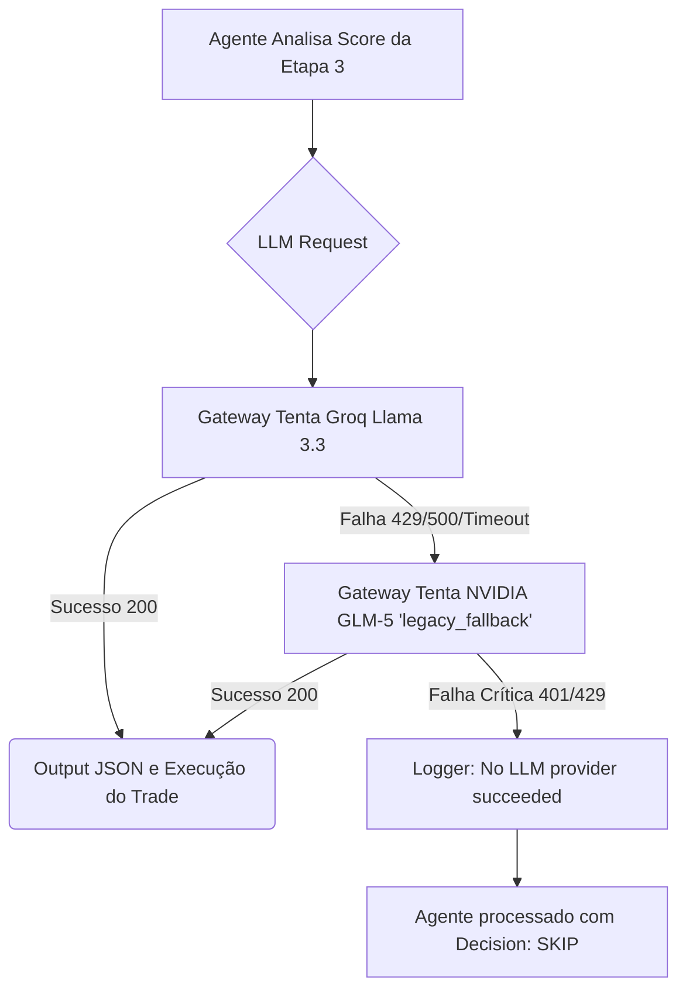

# LLM Fallback Architecture & Configuration (Local Environment)

**Data da Implementação:** 27/03/2026  
**Documento:** Configuração de Resiliência de Provedores de Inteligência Artificial

Este documento detalha a atualização da arquitetura de roteamento de LLM (`llmGateway.ts`) implementada para uso em ambiente `LOCAL`. A transição remove a dependência do Google Gemini (que bloqueava a pipeline por limites estritos no tier gratuito - *Rate Limit 429*) em favor de um ecossistema 100% compátivel com endpoints no formato OpenAI.

---

## 1. Nova Arquitetura de Provedores

O roteador de LLM no bot opera seguindo uma hierarquia rigorosa, onde o **Provedor Primário** é chamado em primeiro lugar e o **Provedor Secundário (Fallback)** só entra em ação quando o primário retorna erro ou esgota sua quota.

A nova configuração exclui o protocolo proprietário de chamadas do Google (Gemini SDK) a favor do método agnóstico (Axios/REST), padronizando a comunicação via `legacy` e `legacy_fallback`.

### Provedor Primário (`legacy`) - **GROQ**
- **Modelo:** `llama-3.3-70b-versatile`
- **URL Base:** `https://api.groq.com/openai/v1/chat/completions`
- **Limites Estimados (Tier 1):** ~30 Requests/min | 14.4K Tokens/min | 500K Tokens/dia
- **Propósito:** Processar a imensa maioria dos sinais JSON baseados no pipeline de Análise Técnica Rápida (Estágio 3 - Scalper).
- **Vantagem:** Extremamente veloz (tokens gerados por segundo muito altos) e projetado nativamente para estruturas restritas como o payload JSON esperado.

### Provedor Secundário (`legacy_fallback`) - **NVIDIA**
- **Modelo:** `z-ai/glm5`
- **URL Base:** `https://integrate.api.nvidia.com/v1/chat/completions`
- **Limites Fixados:** 40 Requests/minuto
- **Propósito:** Agir puramente como salva-vidas e contingência de falhas temporárias na rede da Groq.
- **Vantagem:** Evita que falhas na API principal paralisem ou cancelem operações que já passaram nas severas pontuações de Risk e Organicity. Conserva o rigor arquitetural e formatação garantindo o mesmo padrão estruturado.

---

## 2. Diagrama de Fallback



---

## 3. Configuração do `.env` e Setup

Para que o pipeline utilize a nova estrutura fluida de fallbacks compatíveis com a infra da OpenAI, estas são as linhas chaves presentes no `.env` do desenvolvimento local:

```env
# Define a hierarquia que o gateway tentará
LLM_PROVIDER_ORDER=legacy,legacy_fallback
LEARNER_LLM_PROVIDER_ORDER=legacy,legacy_fallback
POSTMORTEM_LLM_PROVIDER_ORDER=legacy,legacy_fallback

# Configuração do Provedor Primário (Groq)
LLM_MODEL=llama-3.3-70b-versatile
LEGACY_LLM_API_URL=https://api.groq.com/openai/v1/chat/completions
NV_LLM_API_KEY=gsk_[sua_chave]

# Configuração do Provedor de Fallback (NVIDIA)
NVIDIA_FALLBACK_API_URL=https://integrate.api.nvidia.com/v1/chat/completions
NVIDIA_FALLBACK_MODEL=z-ai/glm5
NVIDIA_FALLBACK_API_KEY=nvapi-[sua_chave]
```

> **Nota para Desenvolvedores:**  Apesar da chave do Groq estar associada internamente ao nome `NV_LLM_API_KEY`, o script do sistema prioriza a URL definida pelo `.env` (`LEGACY_LLM_API_URL`) para fazer o switch apropriado antes do parse dinâmico. Foi adicionada também a tratativa para URL/chaves relativas ao prefixo `NVIDIA_FALLBACK_` para as lógicas de contorno da `llmGateway.ts`.

---

## 4. Testes de Health & Resiliência
Estão validades duas operações (via testes isolados com `curl`) onde garantimos que ambas AS chaves respondem favoravelmente na sintaxe correta do formato Mensagem-Chat (`choices[0].message.content`). Essa congruência JSON assegura que dados capturados de relatórios complexos — como Análise Qualitativa da Bonding Curve e Transferências — sejam ingeridos corretamente pelos Modelos.
