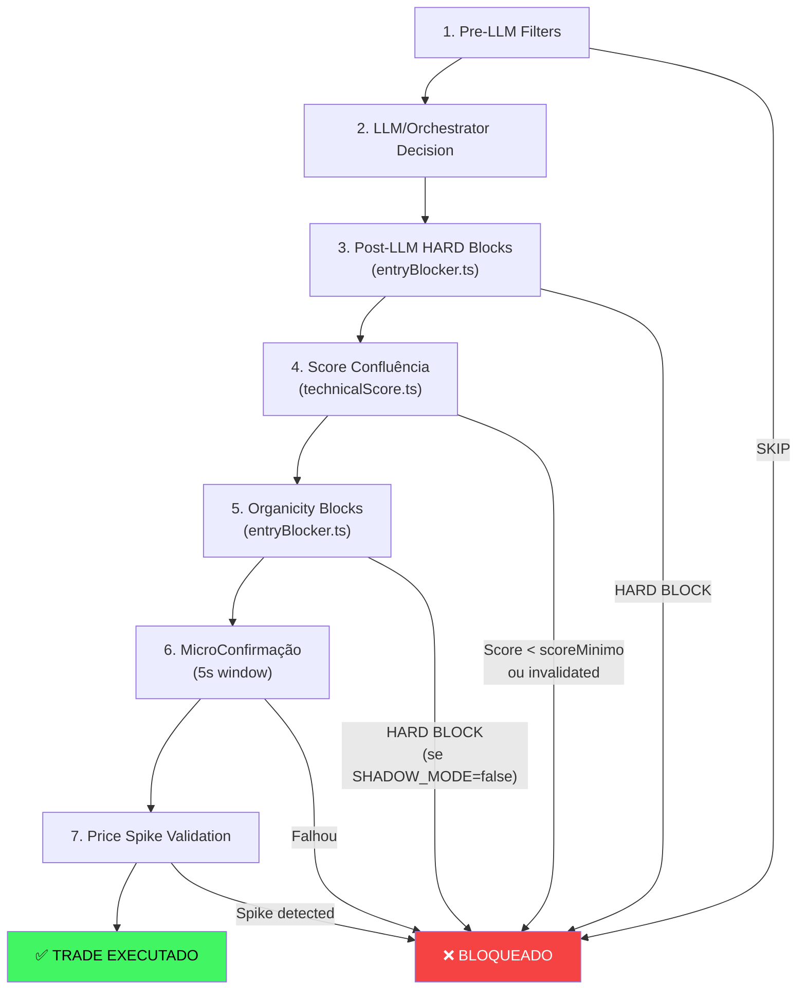

# Bot Parou de Executar Trades — Diagnóstico Completo e Plano de Solução

## Contexto do Problema

Após deploy de ~11/03/2026 com incremento de análise técnica e proteção contra crescimento artificial, o bot parou completamente de executar trades. Antes da atualização, operava com lucro.

## Diagnóstico: 7 Camadas de Bloqueio em Cascata

O pipeline de decisão do bot (em [agentOrchestrator.ts](file:///home/srant/projects/pumpfun-bonding-curve-Test/utils/agentOrchestrator.ts)) exige que **TODAS as 7 camadas** passem para executar um trade. Basta **uma falhar** para bloquear:



### Camada 3 — Post-LLM HARD Blocks ([entryBlocker.ts](file:///home/srant/projects/pumpfun-bonding-curve-Test/utils/entryBlocker.ts))

10 possíveis HARD blocks que bloqueiam TOTALMENTE:

| Block | Condição | Threshold Atual |
|-------|----------|-----------------|
| `BLOCK_COOLDOWN` | Após loss | 30s (OK) |
| `BLOCK_CONSECUTIVE_STOPS` | ≥3 stops | 60s pausa (OK) |
| `BLOCK_INSUFFICIENT_DATA` | <3 candles | (OK) |
| `BLOCK_VWAP_DISTANCE` | dist > maxDistVWAPPct | **6% (AGGRESSIVE)** |
| `BLOCK_CANDLE_STRETCHED` | range > multiplier × ATR | **4× (AGGRESSIVE)** |
| `BLOCK_ATR_DEAD` | ATR < atrMinPct | **0.015% (AGGRESSIVE)**, mas DEFAULT=**0.05%** ⚠️ |
| `BLOCK_ATR_EXTREME` | ATR > atrMaxPct | **10% (AGGRESSIVE)** |
| `BLOCK_RSI_OVERBOUGHT` | RSI > rsiOverboughtBlock | **88 (AGGRESSIVE)** |
| `BLOCK_3RD_LEG` | legs > maxLegsWithoutPullback | **4 (AGGRESSIVE)** |
| `BLOCK_VOLUME_SPIKE_NO_FOLLOW` | spike + micro <0.1% | **0.5%** ⚠️ NÃO OVERRIDE |

> [!CAUTION]
> **`BLOCK_VOLUME_SPIKE_NO_FOLLOW`** usa `config.volumeSpikeFollowMinPct` que vale **0.5%** no DEFAULT e **não é sobrescrito** pelo [ta-config.json](file:///home/srant/projects/pumpfun-bonding-curve-Test/data/ta-config.json) AGGRESSIVE, tornando-o extremamente restritivo para tokens PumpFun que frequentemente têm spikes de volume.

### Camada 4 — Score de Confluência ([technicalScore.ts](file:///home/srant/projects/pumpfun-bonding-curve-Test/utils/technicalScore.ts))

Score máximo possível: **100 pontos** distribuídos em:
- Tendência (30 pts): EMA aligned, slope, spread, VWAP
- Impulso (30 pts): MACD, RSI in bull zone, ROC
- Confirmação (25 pts): Volume burst, Donchian, ATR healthy
- Bônus (5 pts): Micro-trend
- Penalidades: VWAP dist (-5), RSI overbought (-10), MACD decel (-5)

**+ 6 condições de INVALIDAÇÃO** dentro do próprio score que zeram o trade:

| Invalidação | Threshold AGGRESSIVE |
|-------------|---------------------|
| VWAP distance | 6% |
| Candle stretched | 4× ATR |
| RSI overbought | 88 |
| ATR dead (morto) | **0.015%** |
| ATR extreme (caos) | 10% |
| Volume spike no follow | **0.1% micro-trend** (hardcoded) |

> [!WARNING]
> O `scoreMinimo` em AGGRESSIVE é 35/100, mas para atingir esse score, o token precisa ter: EMAs alinhadas + MACD positivo + RSI na zona bullish (45-82) + volume acima de 1.0×. Em tokens PumpFun novos com apenas 3+ candles de 1s, **é muito difícil** acumular esses pontos.

### Camada 5 — Organicity Blocks ([entryBlocker.ts#L291-487](file:///home/srant/projects/pumpfun-bonding-curve-Test/utils/entryBlocker.ts#L291-L487))

> [!IMPORTANT]
> **Problema Crítico**: A função [checkOrganicityHardBlocks()](file:///home/srant/projects/pumpfun-bonding-curve-Test/utils/entryBlocker.ts#291-488) é chamada COM THRESHOLDS HARDCODED no default dos parâmetros da função, **NÃO lidos do ta-config.json**:
> ```typescript
> checkOrganicityHardBlocks(h, orgResult, prices1sNow)  // ← sem thresholds customizados!
> ```
> Usa defaults como `minTrades20s=5`, `minUniqueBuyers30s=3`, `minUniqueWalletsLifetime=10`, etc.

Possui **3 HARD blocks**:
- `BLOCK_EXCESSIVE_LINEARITY`: R² > 0.98 com ≥20 prices (staircase bot)
- `BLOCK_ORDER_REPETITION`: >70% mesmos tamanhos de order
- `BLOCK_ARTIFICIAL_COMBO`: 0 pullbacks + R²>0.97 + alternância<15% com ≥40 prices

E **12 SOFT blocks** que informam mas não bloqueiam.

### Camada 6 — MicroConfirmação ([microConfirmation.ts](file:///home/srant/projects/pumpfun-bonding-curve-Test/utils/microConfirmation.ts))

**Janela de 5 segundos** que pode bloquear por:
- Atividade parou (0 trades em 5s após 2s)
- OrganicScore caiu >20 pts durante janela
- Concentração explosiva: top1 wallet >60%
- Preço avançou >3% durante a janela

> [!WARNING]
> **`ORGANICITY_SHADOW_MODE`** não está configurado no [.env](file:///home/srant/projects/pumpfun-bonding-curve-Test/.env) (default=`false`). Isso significa que tanto a Camada 5 quanto a Camada 6 estão **ATIVAS E BLOQUEANDO** trades, ao invés de apenas observar.

---

## Resumo das Causas Raiz

| # | Causa | Impacto | Severidade |
|---|-------|---------|------------|
| 1 | `ORGANICITY_SHADOW_MODE=false` (não definido no [.env](file:///home/srant/projects/pumpfun-bonding-curve-Test/.env)) | Organicity blocks + MicroConfirm bloqueiam ativamente | 🔴 Crítico |
| 2 | `volumeSpikeFollowMinPct=0.5%` não sobrescrito pelo AGGRESSIVE mode | HARD block em qualquer volume spike sem follow-through de 0.5% | 🔴 Crítico |
| 3 | Score confluência invalidated + scoreMinimo muito difícil de atingir com poucos candles | Tokens novos com 3-10 candles quase nunca passam | 🟡 Alto |
| 4 | [checkOrganicityHardBlocks()](file:///home/srant/projects/pumpfun-bonding-curve-Test/utils/entryBlocker.ts#291-488) chamada sem thresholds customizados | Usa defaults restritivos ao invés dos valores do ta-config.json | 🟡 Alto |
| 5 | MicroConfirm `minTradeActivity=1` em janela de 5s | Tokens com atividade irregular bloqueados | 🟡 Médio |

---

## Proposed Changes

### Fase 1 — Desbloquear imediatamente (mudanças de config, sem código)

#### [MODIFY] [.env](file:///home/srant/projects/pumpfun-bonding-curve-Test/.env)

Adicionar `ORGANICITY_SHADOW_MODE=true` para colocar os filtros de organicidade em modo observação (log mas não bloqueia). Isso restaura o comportamento anterior ao deploy.

---

### Fase 2 — Flexibilizar thresholds no ta-config.json

#### [MODIFY] [ta-config.json](file:///home/srant/projects/pumpfun-bonding-curve-Test/data/ta-config.json)

No modo AGGRESSIVE, adicionar/ajustar:
```diff
 "AGGRESSIVE": {
+  "volumeSpikeFollowMinPct": 0.1,
+  "volumeSpikeFollowCandles": 5,
   "scoreMinimo": 35,
+  "cooldownAfterLossMs": 15000,
+  "maxConsecutiveStops": 5,
   ...
 }
```

---

### Fase 3 — Corrigir chamada do [checkOrganicityHardBlocks](file:///home/srant/projects/pumpfun-bonding-curve-Test/utils/entryBlocker.ts#291-488)

#### [MODIFY] [agentOrchestrator.ts](file:///home/srant/projects/pumpfun-bonding-curve-Test/utils/agentOrchestrator.ts)

Passar thresholds do `taConfig` para [checkOrganicityHardBlocks()](file:///home/srant/projects/pumpfun-bonding-curve-Test/utils/entryBlocker.ts#291-488) ao invés de usar defaults hardcoded:

```diff
- const orgBlocks = checkOrganicityHardBlocks(orgHistory, orgResult, prices1sNow);
+ const orgBlocks = checkOrganicityHardBlocks(
+   orgHistory, orgResult, prices1sNow,
+   /* minTrades20s */ 3,
+   /* minUniqueBuyers30s */ 2,
+   /* minUniqueWalletsLifetime */ 5,
+   /* minAlternationRatio */ 0.15,
+   /* maxLinearityR2 */ 0.98,
+   /* maxTop1WalletSharePct */ 70,
+   /* maxTop2WalletSharePct */ 85,
+   /* maxOrderRepetitionRatioHard */ 0.75,
+   /* maxOrderRepetitionRatioSoft */ 0.55,
+   /* minOrganicScore */ taConfigExec.minOrganicScore ?? 30
+ );
```

---

### Fase 4 — Flexibilizar MicroConfirmação

#### [MODIFY] [microConfirmation.ts](file:///home/srant/projects/pumpfun-bonding-curve-Test/utils/microConfirmation.ts)

Ajustar defaults para serem menos restritivos:

```diff
 export const DEFAULT_MICRO_CONFIRM_CONFIG: MicroConfirmationConfig = {
-    windowMs: 5000,
+    windowMs: 3000,
     intervalMs: 1000,
-    maxOrganicScoreDrop: 20,
+    maxOrganicScoreDrop: 30,
     maxPriceAdvancePct: 3.0,
-    maxNewWalletSharePct: 60,
+    maxNewWalletSharePct: 75,
     minTradeActivity: 1,
 };
```

---

### Fase 5 — Garantir fallback no technicalScore.ts

#### [MODIFY] [technicalScore.ts](file:///home/srant/projects/pumpfun-bonding-curve-Test/utils/technicalScore.ts)

Relaxar a invalidação de volume spike no follow para alinhar com o config AGGRESSIVE:

```diff
 // Volume spike sem follow-through
 if (snap.volumeRelative?.isSpike && snap.microTrend !== null) {
-    if (Math.abs(snap.microTrend.changePct) < 0.1) {
+    if (Math.abs(snap.microTrend.changePct) < (config as any).volumeSpikeFollowMinPctInline ?? 0.05) {
         invalidReason = ...
     }
 }
```

> [!NOTE]
> Alternativamente, usar o `config.volumeSpikeFollowMinPct` já existente no config ao invés do hardcoded `0.1`.

---

## Prioridade de Implementação

| Prioridade | Fase | Efeito Esperado |
|------------|------|-----------------|
| 🔴 P0 | **Fase 1**: `SHADOW_MODE=true` + deploy | Bot volta a operar imediatamente (organicity observa mas não bloqueia) |
| 🟡 P1 | **Fase 2**: Ajustar ta-config.json | Reduz bloqueios por thresholds muito apertados |
| 🟡 P1 | **Fase 3**: Fix checkOrganicityHardBlocks | Thresholds passam a respeitar ta-config.json |
| 🟢 P2 | **Fase 4**: MicroConfirm menos restritivo | Menos bloqueios na janela de 5s |
| 🟢 P2 | **Fase 5**: Volume spike threshold | Evita invalidação em tokens com spikes normais |

---

## Verification Plan

### Manual Verification (pós-Fase 1)
1. Adicionar `ORGANICITY_SHADOW_MODE=true` no [.env](file:///home/srant/projects/pumpfun-bonding-curve-Test/.env)
2. Fazer deploy para VPS
3. Verificar nos logs PM2 (`pm2 logs pumpfun-bot`) que:
   - O bot está processando tokens
   - Aparecem mensagens `🔬 [SHADOW]` (organicity observando)
   - Mensagens `✅ [Post-LLM Full]` indicam trades aprovados
   - Trades aparecem no dashboard

### Manual Verification (pós-fases 2-5)
1. Após aplicar as mudanças, fazer deploy
2. Monitorar por 30 minutos verificando logs PM2
3. Confirmar que trades estão sendo executados no dashboard
4. Verificar que o fallback automático NÃO está ativando (sinal de que trades estão fluindo)

> [!TIP]
> Se após Fase 1 (SHADOW_MODE=true) o bot voltar a operar, as fases 2-5 podem ser implementadas gradualmente, ligando o SHADOW_MODE=false depois de ajustar os thresholds.
