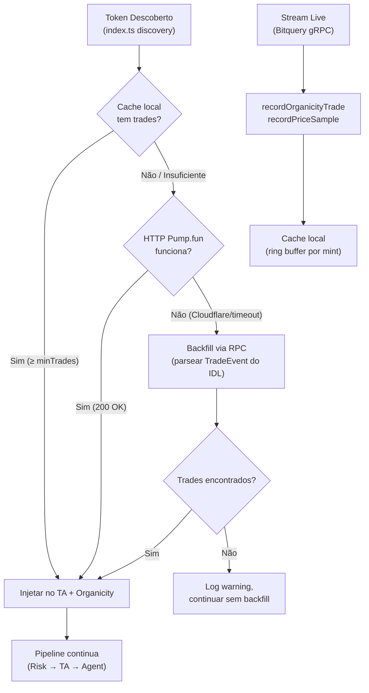

# Backfill Resiliente: Cache Local + RPC Histórico + Degradação Graciosa

## Contexto do Problema

O backfill atual em [pumpfunHistory.ts](file:///home/srant/projects/pumpfun-bonding-curve-Test/utils/pumpfunHistory.ts) depende de um único endpoint HTTP (`frontend-api.pump.fun/trades/all/{mint}`). Quando bloqueado pelo Cloudflare (rate limit, WAF), o token entra no pipeline sem histórico, resultando em:

- **TA (Stage 3)**: `DADOS_INSUFICIENTES` — MACD/RSI/EMA sem candles para calcular
- **Organicidade (Stage 4)**: Sem dados de wallets/volumes para R², alternation, churn
- **Decisão do Agent**: Opera "às cegas" ou bloqueia tokens viáveis

Os dois call sites afetados são:
- [index.ts:1392](file:///home/srant/projects/pumpfun-bonding-curve-Test/index.ts#L1392) — discovery via gRPC stream
- [index.ts:2667](file:///home/srant/projects/pumpfun-bonding-curve-Test/index.ts#L2667) — discovery via Bitquery event bus

---

## User Review Required

> [!IMPORTANT]
> **Estratégia de transição**: O plano mantém o HTTP original como **primeira tentativa** (é ~10x mais rápido quando funciona). Ele só é substituído por RPC quando falha. Isso evita quebrar o fluxo durante a validação. Concorda com esse approach "additive" em vez de "substitutive"?

> [!WARNING]
> **Custos de RPC**: O backfill via RPC requer 1x `getSignaturesForAddress` + N x `getParsedTransaction` por token (N ≈ 50 trades). Isso pode consumir ~51 RPC calls por discovery. Com o `rpcLimiter` em `getBonding.ts` (5 concurrent, 200ms gap), o backfill de um token levará ~2-3 segundos. Confirme se isso é aceitável no fluxo de discovery.

> [!IMPORTANT]
> **Ring buffer**: Proponho 200 trades por token com TTL de 20min (alinhado com o TTL do organicityMonitor). Token com mais de 200 trades é raro na bonding curve. Concorda com esses limites?

---

## Arquitetura Proposta: 3 Camadas



---

## Proposed Changes

### Componente 1 — Live Trade Cache (Ring Buffer)

#### [NEW] [liveTradeCache.ts](file:///home/srant/projects/pumpfun-bonding-curve-Test/utils/liveTradeCache.ts)

Cache em memória alimentado **passivamente** pelos trades que já passam pelo pipeline live. Quando um novo token é descoberto, o cache já pode ter trades acumulados dos últimos minutos.

```typescript
// Estrutura do cache
interface CachedTrade {
  timestamp: number;
  wallet: string;
  side: "BUY" | "SELL";
  solAmount: number;
  tokenAmount: number;
  price: number;
}

// Configuração
const MAX_TRADES_PER_TOKEN = 200;
const CACHE_TTL_MS = 20 * 60 * 1000;   // 20 min (alinhado com organicityMonitor)
const MAX_CACHED_TOKENS = 3000;         // limite global de memória
const CLEANUP_INTERVAL_MS = 60_000;
```

**Comportamento**:
- `recordLiveTrade(mint, trade)` — chamado nos mesmos pontos onde já chamamos `recordPriceSample` e `recordOrganicityTrade` no pipeline live
- `getCachedTrades(mint)` — retorna trades em ordem cronológica
- `getCachedTradeCount(mint)` — rápido, para decidir se precisa de backfill adicional
- Cleanup periódico: remove tokens com `lastTradeTimestamp > TTL` e faz eviction por LRU quando `size > MAX_CACHED_TOKENS`

**Impacto na memória**: ~200 trades × 100 bytes/trade × 3000 tokens = ~57 MB worst-case (dentro do budget de memória do bot)

---

### Componente 2 — RPC Historical Parser

#### [NEW] [pumpfunRpcBackfill.ts](file:///home/srant/projects/pumpfun-bonding-curve-Test/utils/pumpfunRpcBackfill.ts)

Parser on-chain que reconstrói trades a partir do `TradeEvent` do IDL (`pump_0.1.0.json`). Usa o `rpcPool` existente com `executeWithFallback`.

**Estratégia de parsing** (baseada no IDL):

O `TradeEvent` do PumpFun (IDL lines 501-544) emite os seguintes campos em cada trade:
- `mint` (publicKey)
- `solAmount` (u64) — em lamports
- `tokenAmount` (u64) — em unidades base (6 decimais)
- `isBuy` (bool)
- `user` (publicKey) — wallet do trader
- `timestamp` (i64) — Unix seconds
- `virtualSolReserves` (u64)
- `virtualTokenReserves` (u64)

**Fluxo de parsing**:

1. **Buscar signatures**: `getSignaturesForAddress(bondingCurveAddress || mint, { limit: 100 })` via `rpcPool.executeWithFallback`
   - Preferir `bondingCurveAddress` quando disponível (filtra SOMENTE trades na curva PumpFun)
   - Fallback para `mint` quando bonding curve não está disponível (mais ruído, mas funcional)

2. **Filtrar transações falhadas**: Descartar signatures com `err !== null`

3. **Buscar transações em batch** (5 por vez, respeitando `Bottleneck`): `getParsedTransaction(signature, { maxSupportedTransactionVersion: 0 })`

4. **Parsear TradeEvent via log messages**: Usar o `SolanaEventParser` existente em [event-parser.ts](file:///home/srant/projects/pumpfun-bonding-curve-Test/utils/event-parser.ts) com o coder do IDL `pump_0.1.0.json` para extrair eventos `TradeEvent` dos `logMessages` da transação

5. **Normalizar para o shape do pipeline**:
```typescript
interface BackfillTrade {
  mint: string;
  wallet: string;
  side: "BUY" | "SELL";
  solAmount: number;      // em SOL (não lamports)
  tokenAmount: number;    // em unidades com decimais aplicados
  price: number;          // solAmount / tokenAmount
  timestamp: number;      // em ms
  signature: string;
}
```

6. **Retornar em ordem cronológica** (oldest-first), limitado a `limit` trades

**Rate limiting**: Usar o mesmo `Bottleneck` de [getBonding.ts](file:///home/srant/projects/pumpfun-bonding-curve-Test/utils/getBonding.ts#L7) (5 concurrent, 200ms min time) para não saturar o RPC

**Timeout global**: 8 segundos para todo o backfill RPC de um token (se exceder, retorna o que conseguiu)

---

### Componente 3 — Orquestrador de Backfill

#### [MODIFY] [pumpfunHistory.ts](file:///home/srant/projects/pumpfun-bonding-curve-Test/utils/pumpfunHistory.ts)

Refatorar `backfillTokenHistory` para orquestrar as 3 camadas em cascata:

```typescript
export async function backfillTokenHistory(
  mint: string, 
  limit: number = 50, 
  bondingCurveAddress?: string
): Promise<void> {
  // CAMADA 1: Cache local (microsegundos)
  const cached = getCachedTrades(mint);
  if (cached.length >= limit) {
    injectTradesIntoMonitors(mint, cached.slice(-limit));
    return;  // Cache suficiente, sem I/O
  }

  // CAMADA 2: HTTP Pump.fun (fallback rápido, ~200ms quando funciona)
  try {
    const httpTrades = await fetchHttpBackfill(mint, limit);
    if (httpTrades.length > 0) {
      injectTradesIntoMonitors(mint, httpTrades);
      return;
    }
  } catch (err) {
    logger.warn(`⚠️ [Backfill] HTTP falhou para ${mint}: ${err.message}. Tentando RPC...`);
  }

  // CAMADA 3: RPC on-chain (fallback robusto, ~2-3s)
  try {
    const needed = limit - cached.length;
    const rpcTrades = await fetchRpcBackfill(mint, needed, bondingCurveAddress);
    const merged = deduplicateAndMerge(cached, rpcTrades);
    injectTradesIntoMonitors(mint, merged);
  } catch (err) {
    logger.error(`❌ [Backfill] RPC também falhou para ${mint}: ${err.message}`);
    // Se temos cache parcial, usar o que temos
    if (cached.length > 0) {
      injectTradesIntoMonitors(mint, cached);
    }
  }
}
```

**Mudança na assinatura**: Adicionar parâmetro opcional `bondingCurveAddress` para permitir query mais precisa via RPC

---

### Componente 4 — Integração no Pipeline

#### [MODIFY] [index.ts](file:///home/srant/projects/pumpfun-bonding-curve-Test/index.ts)

**4 mudanças pontuais**:

1. **Import do cache** (topo do arquivo):
```typescript
import { recordLiveTrade } from './utils/liveTradeCache';
```

2. **Alimentar cache nos trades live** (~line 1089 e ~line 1414, onde já chamamos `recordPriceSample`):
```typescript
// Após recordPriceSample e recordOrganicityTrade:
recordLiveTrade(tOutput.mint, {
  timestamp: Date.now(),
  wallet: tOutput.user,
  side: tOutput.type as "BUY" | "SELL",
  solAmount: Number(tOutput.solAmount) || 0,
  tokenAmount: Number(tOutput.tokenAmount) || 0,
  price: currentPrice,
});
```

3. **Passar bondingCurve ao backfill** (line 1392):
```typescript
// Antes: await backfillTokenHistory(tOutput.mint, 50);
await backfillTokenHistory(tOutput.mint, 50, tOutput.bondingCurve);
```

4. **Passar marketAddress ao backfill** (line 2667):
```typescript
// Antes: await backfillTokenHistory(candidate.mint, 50);
await backfillTokenHistory(candidate.mint, 50, candidate.marketAddress);
```

---

## Componente 5 — WebSocket PumpFun (Opcional / Fase 2)

> [!NOTE]
> Este componente é **opcional** e só deve ser implementado após validação da Fase 1. Ele adiciona redundância live, mas **não substitui o backfill**.

Se decidir implementar, as regras da documentação oficial são:
- **Uma única conexão** para `wss://pumpportal.fun/api/data`
- Reconexão automática com backoff exponencial
- Usar `subscribeTokenTrade` para receber trades em tempo real
- Alimentar o `liveTradeCache` e os monitores com os dados recebidos
- **Não usar como fonte de backfill histórico**

---

## Open Questions

> [!IMPORTANT]
> **Derivação do bondingCurveAddress**: Quando o bonding curve address não está disponível nos metadados do discovery (ex: em alguns trades do Bitquery), você prefere:
> 
> (a) Derivar via PDA usando `findProgramAddress([Buffer.from("bonding-curve"), mint.toBuffer()], PUMP_FUN_PROGRAM_ID)` — preciso confirmar que a seed é esta
> 
> (b) Fazer fallback para query por mint mesmo (mais ruído mas funcional)
> 
> (c) Ambos: tentar PDA primeiro, fallback para mint

> [!IMPORTANT]
> **Limite de trades RPC**: O IDL permite buscar até ~1000 signatures por chamada. Configurar 100 como default (para ter margem de transações falhadas que serão descartadas)? Ou 50 é suficiente?

---

## Verification Plan

### Automated Tests

1. **Teste unitário do parser RPC**:
```bash
npx ts-node -e "
  const { fetchRpcBackfill } = require('./utils/pumpfunRpcBackfill');
  // Usar um token PumpFun conhecido já na curva
  fetchRpcBackfill('TOKEN_MINT_KNOWN', 20).then(trades => {
    console.log('Trades encontrados:', trades.length);
    trades.forEach(t => console.log(t.side, t.solAmount, t.price, t.wallet.substring(0,8)));
  });
"
```

2. **Teste de comparação HTTP vs RPC**:
```bash
# Buscar o mesmo token por ambos os métodos e comparar:
# - Contagem de trades
# - Direção BUY/SELL de cada trade
# - solAmount (desvio < 1%)
# - price derivado (desvio < 5%)
```

3. **Teste de integração**: Simular Cloudflare block (mockar axios.get para retornar 403) e verificar que o fallback RPC funciona corretamente

4. **Type check**: `npx tsc --noEmit`

### Manual Verification

- Observar logs do bot em produção por 24h após deploy
- Verificar que tokens que antes recebiam `DADOS_INSUFICIENTES` agora passam pelo TA normalmente
- Monitorar uso de memória (ring buffer não deve causar leak)
- Verificar que o rate de chamadas RPC não excede o plano contratado

### Métricas de Sucesso

| Métrica | Antes | Meta |
|---|---|---|
| Backfill success rate | ~60% (CF blocks) | > 95% |
| Tokens com TA válido | ~60% | > 90% |
| Latência média backfill | ~200ms (HTTP) | < 3s (com RPC fallback) |
| Memória adicional | 0 | < 60 MB |

---

## Resumo dos Arquivos

| Arquivo | Ação | Descrição |
|---|---|---|
| `utils/liveTradeCache.ts` | **NOVO** | Ring buffer de trades live por mint |
| `utils/pumpfunRpcBackfill.ts` | **NOVO** | Parser histórico via RPC + IDL TradeEvent |
| `utils/pumpfunHistory.ts` | **MODIFICAR** | Orquestrador de 3 camadas (cache → HTTP → RPC) |
| `index.ts` | **MODIFICAR** | 4 mudanças pontuais (import, alimentar cache, passar bondingCurve) |
